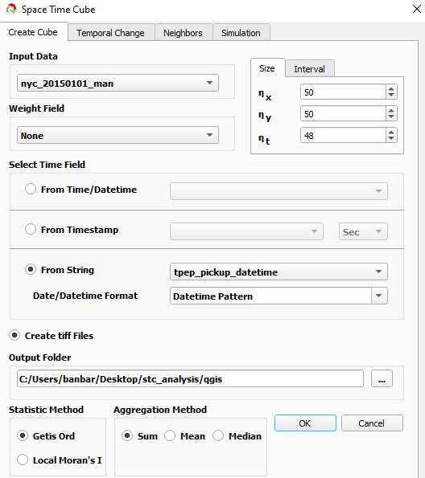
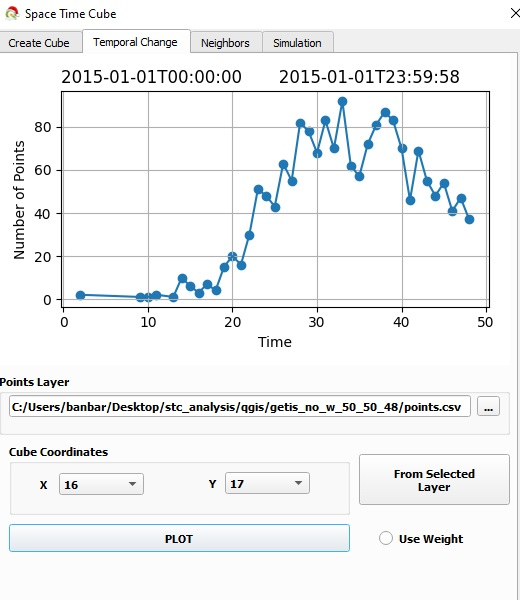
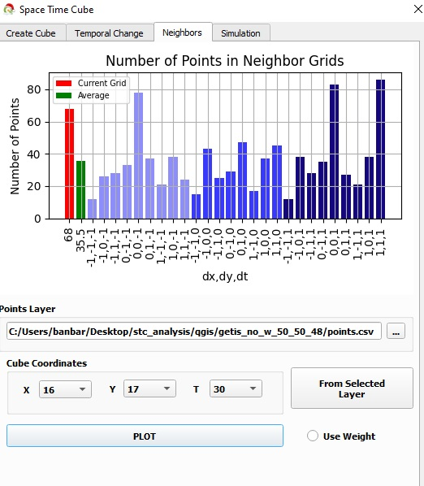
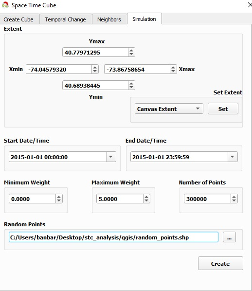
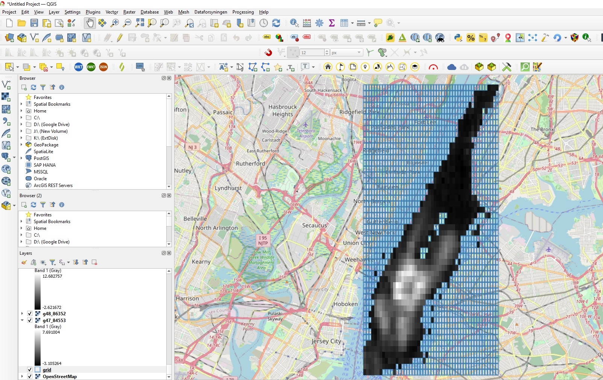

# SpaceTimeCube

This repository contains the sample data and code of the 'Space Time Cube' plugin of QGIS 3.x.
* The URL of the plugin: <a href="https://plugins.qgis.org/plugins/space_time_cube/" target="_blank">`https://plugins.qgis.org/plugins/space_time_cube/`</a>
* Video tutorial: <a href="https://www.youtube.com/watch?v=Ibbs7u-iawE" target="_blank">`https://www.youtube.com/watch?v=Ibbs7u-iawE`</a>
* [New York City taxi data](https://data.cityofnewyork.us/Transportation/2015-Yellow-Taxi-Trip-Data/ba8s-jw6u) - the Geopackage of the data could be found at the end of this Readme.

The main purpose of the plugin is the detection of hot spots localised in space and time using two different statistics:
1. Getis-Ord $G_i$*, and
2. Local Moran's I.

The plugin requires the following inputs:
* **Input data:** the space-time point data set available in the QGIS layer panel.
* **Weight field:** whether a weight is assigned to the points. One of the attributes of the data could be selected.
* **Cube dimensions:**
  * The first option *size* allows the selection of the number of cells for each axis.
  * The second option *internal* allows the user to specify the approximated length of a cell.

---
**Example**

Assume maximum distance between two points along the *x*-axis is 1248 metres.

1. **Size** parameter $\eta_x = 50$: The length of a cell on the *x*-axis would be 24.96 metres.
2. **Interval** parameter $\Delta x = 100$ metres, then there would be 12 cells on the *x*- axis each having a length of 104 metres. This approximation was realised in order to minimise the edge effect.  
---

* **Select time field:** The user can select the time field based on various different representations.
* **Create tiff files:** This optional field creates tiff files for each time slice.
* **Statistic Method:** Determines the hot spot detection method.
* **Aggregation Method:** How the points inside a cell are aggregated. If no weight is assigned, then ***Sum*** should be used. If there is a weight, then all three options are viable.

  

The **second tab** of the plugin allows interactive analysis by plotting how the value of the selected cell varies. The selection of the cell could either be done via the QGIS interface and by clicking the **From Selected Layer** button, or from the dropdown list.

For example, when the cell that contains the [Times Square of NYC](https://goo.gl/maps/gS4cS3dwwFjgGbMW6) was analysed on New Year's Day, no taxi dropoff was observed until around 3 a.m. due to road closures. Note that $\Delta x = 48$, corresponding to each temporal unit to be 30 minutes, and the graph demonstrates activity around the $10^th$ unit.

  

The **third tab** of the plugin also allows interactive analysis by plotting how the values of neighbouring cells of the selected cell varies.

  

$\color{#FF0000}{The ~ value ~ of ~ a ~ cell}$ can be compared with its neighbouring cells' values. $\color{#017F02}{The ~ mean ~ of ~ neighbouring ~ cells}$ are also displayed next to it.  

In this way, users can have a better understanding how the neighbouring cells' values changed.
* $\color{#8C8FFA}{The ~ first  ~ colour ~ code}$ represents the previous time unit,
* $\color{#3B38FB}{The ~ second ~ colour ~ code}$ represents the same temporal unit, and
* $\color{#12077F}{The ~ third ~ colour ~ code}$ represents the next temporal unit.

The **fourth tab** of the plugin generates random space-time point data. This simulated data is important to compare the statistics values with randomly generated data.

  

The spatial and temporal extents of the data could be defined, as well as whether a weight is assigned to each point, and if so its range.

If the optional parameter **create tiff files** had been selected, for each time slice a tiff file would be created providing cell-level statistic (Getis-Ord $G_i$* or Local Moran's I) values. In addition, the 2D grids shapefile would also be created:

  

---
## Python Package - spacetimecube

The aforementioned functionality was also developed as the Python package [spacetimecube](https://pypi.org/project/spacetimecube/) in order to efficiently conduct sensitivity analysis on the parameters (especially on the dimensions of a cell).  

The following versions of the packages are required:

  

The Jupyter Notebook and associated data (i.e. `Dropoff locations @ Manhattan, on New Year's Day of 2015`) could be downloaded from: <a href="http://yunus.hacettepe.edu.tr/~banbar/stc_analysis_jupyter.zip" target="_blank">`http://yunus.hacettepe.edu.tr/~banbar/stc_analysis_jupyter.zip`</a>
